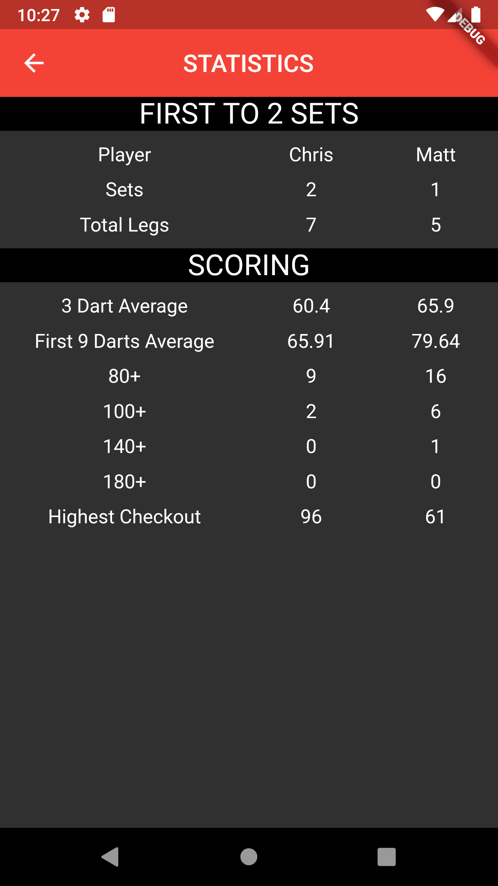

## Darts Scoreboard
A basic Flutter project that keeps track of the score of a match of X01 darts.

## Usage
1. Ensure flutter is installed on your machine
1. Clone this repository
1. Open an emulator and run `flutter run` within the cloned repository's folder

Alternatively, in the `.apks/` folder, I have included the `.apk` files that can be downloaded directly onto an Android device. If you don't know which Android ABI your device is using, then you can just download the larger `app-release.apk`.

   
   
   